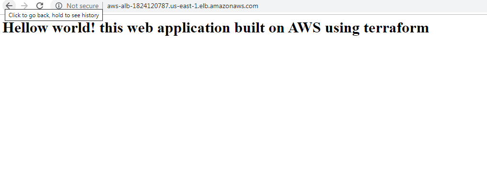

# terraform-aws-secure-webapplication
This project is for architecting a secure web application using natgateway, bastion host and aplication load balancer hosted on aws using terraform 

This project will create a bastion host for securing access to login to private ec2 web servers that are hosting web application and attached to an application load balancer

Design
-------------------------
Check diagram for the design of this end project

 

Requirement
--------------------------
terraform v0.12

AWS provider from terrafrom init

Usage
-----------------------------------

I did not load my aws credentials using variables or in any file. I have exported the default region, access key and secret on the shell to run my terraform init, get, plan, apply, destroy

export AWS_DEFAULT_REGION="us-east-1"

export AWS_ACCESS_KEY_ID="AKI*****************"

export AWS_SECRET_ACCESS_KEY="vsfs********"

terraform validate

terraform init

terraform plan -out=tfplan

terraform apply tfplan

terraform destroy -auto-approve

Output
--------------------------------------------
Apply complete! Resources: 28 added, 0 changed, 0 destroyed.

State path: terraform.tfstate

Outputs:

S3_bucketname = bucket name is s3 bucket id is aws-terraf-59880

a-loadbalancer-dnsname = aws-alb-1824120787.us-east-1.elb.amazonaws.com

bastion_vm-sg = sg-059bfc608f0a3cd49

bastionhost-publicip = [
  "3.219.34.123",
]

ec2-private_vm-securitygroup = sg-07cebb2ef2106025b

ec2-private_vm_ips = [
  "10.123.3.41",
  "10.123.4.22",
]

ec2_keypair = the keypair name is tfs-key

internetgateway-id = igw-00df530ff48a2e344

loadbalancer-secgroup = sg-08e7b14e64ef2fb90

natgateway-publicip = 3.231.125.77

privatesubnets = [
  "subnet-01ef7110a893c4046",
  "subnet-0903775097188ec1c",
]

publicsubnet = [
  "subnet-04b07d45fc97435c9",
  "subnet-0d5e6f67c5107b7cb",
]

vpc-id = vpc-01e28e0dba8de4bd4

Setup of web application
---------------------------------------------------
login to bastion host first to configure the apache on the private ec2 servers since ssh access is blocked to web ec2 instances from ooutside

ubuntu@ubuntu:~$ ssh ec2-user@3.219.34.123

Permission denied (publickey).

ubuntu@ubuntu:~$ eval `ssh-agent`

Agent pid 5476

ubuntu@ubuntu:~$ ssh ec2-user@3.219.34.123

Permission denied (publickey).

add your private key used for ssh access 

ubuntu@ubuntu:~$ ssh-add /home/ubuntu/.ssh/id_rsa.pem 

Identity added: /home/ubuntu/.ssh/id_rsa.pem (/home/ubuntu/.ssh/id_rsa.pem)

ubuntu@ubuntu:~$ 
ubuntu@ubuntu:~$ 
ubuntu@ubuntu:~$ ssh -A ec2-user@3.219.34.123

Last login: Sat Sep 28 04:04:09 2019 from ec2-18-144-40-117.us-west-1.compute.amazonaws.com

       __|  __|_  )
       _|  (     /   Amazon Linux AMI
      ___|\___|___|

https://aws.amazon.com/amazon-linux-ami/2018.03-release-notes/

2 package(s) needed for security, out of 6 available

Run "sudo yum update" to apply all updates.

Now login to the private ec2 web servers 10.123.3.41 and 10.123.4.22 from bastion host to configure apache and index page. below commands on both vm's
 
 ec2-user@ip-10-123-1-83 ~]$ ssh ec2-user@10.123.3.41

The authenticity of host '10.123.3.41 (10.123.3.41)' can't be established.

ECDSA key fingerprint is SHA256:meBMpXzxI4qaEaQ5PeX8C9eThd7ztNL7jx//jwUED7k.

ECDSA key fingerprint is MD5:fb:10:22:74:99:87:55:b8:56:f0:2c:0e:21:98:15:1e.

Are you sure you want to continue connecting (yes/no)? yes

Warning: Permanently added '10.123.3.41' (ECDSA) to the list of known hosts.

       __|  __|_  )
       _|  (     /   Amazon Linux AMI
      ___|\___|___|

https://aws.amazon.com/amazon-linux-ami/2018.03-release-notes/

[ec2-user@ip-10-123-3-41 ~]$ 

  sudo yum update -y

  sudo yum install -y httpd

  sudo service https start

  sudo chkconfig httpd on

  echo "<h1>Hellow world! this web application built on AWS using terraform</h1>" | sudo tee /var/www/html/index.html

Repeat the same on other private ec2 vm 10.123.4.22
Check the result on load balancer dns
------------------------------------------
copy and paste load balancer dns aws-alb-1824120787.us-east-1.elb.amazonaws.com in a browser to view the result

screenshot attached on 

Fututre work
------------------------

1. Need to create an elastic ip and attach it to the bastion host just in case if the bastion host need a reboot in any case it might lose the public ip 
2. store terraform state file in s3 backend for availability and disaster recovery
3. configure user data scripts to deploy  web servers during boot

